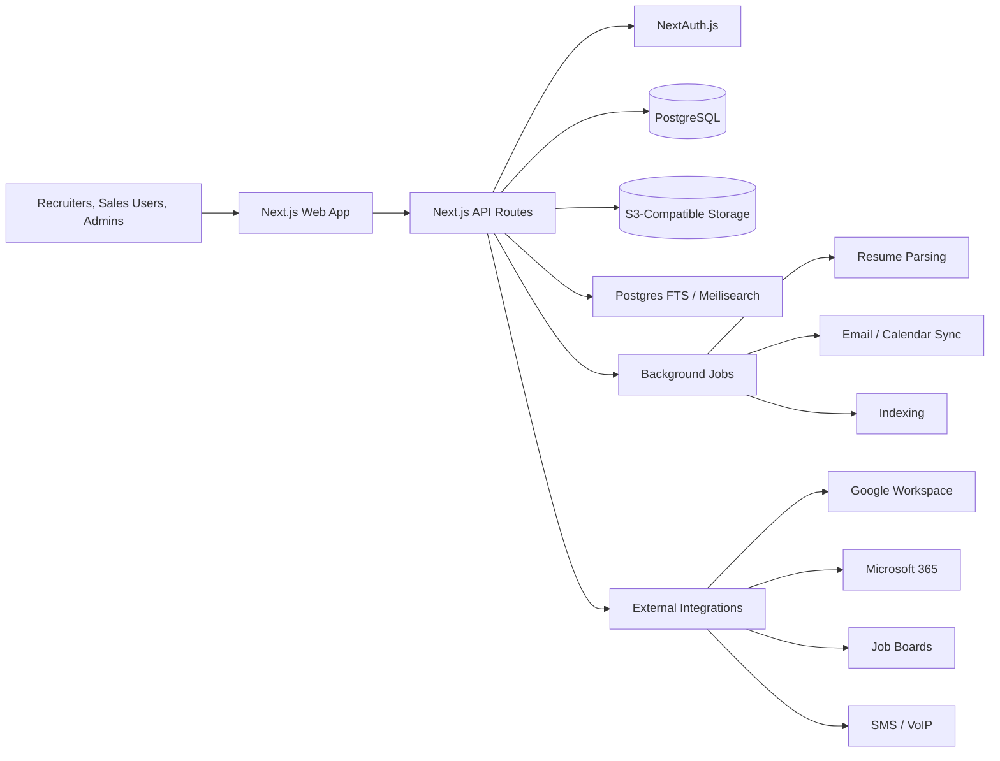

# OpenHorn Product Brief: Open-Source Bullhorn Alternative for Staffing and Recruiting Agencies

**Author:** Manus AI  
**Date:** May 21, 2026  
**Intended use:** Product specification and market brief for an AI-generated MVP

## Executive Summary

OpenHorn should be positioned as a **fast, transparent, open-source ATS + recruiting CRM for staffing agencies** that have outgrown spreadsheets and lightweight corporate ATS tools but cannot justify Bullhorn’s cost, complexity, or implementation overhead. Bullhorn remains the market reference product because it combines agency CRM, applicant tracking, placements, onboarding, time, expense, billing, automation, reporting, VMS integrations, and a large partner marketplace in one staffing-specific platform.[1] [2] [3] [4] Its strength is breadth; its vulnerability is that many small and mid-sized agencies experience the product as expensive, clunky, complex, or overbuilt.[10] [11] [12]

OpenHorn’s initial wedge should not be “all of Bullhorn, but open source.” That would be too broad. The winning V1 should deliver the **front-office system of record** for boutique and small-to-mid-sized staffing agencies: Candidates, Companies, Contacts, Job Orders, Submissions, Placements, Activities, Notes, Tasks, Documents, email/calendar sync, full-text search, and basic reporting. Back-office payroll, invoicing, VMS automation, advanced onboarding, AI sourcing, and omnichannel automation should be deferred until V2 or V3.

| Strategic decision | Recommendation | Rationale |
| --- | --- | --- |
| Target buyer | Staffing agencies with roughly 2–100 recruiters, especially boutique perm, contract, IT, healthcare, professional services, and light industrial agencies | Bullhorn sells from 1–2 user agencies to global enterprises, but its deepest differentiation is enterprise breadth; OpenHorn should win where simplicity and cost transparency matter most.[2] |
| Product category | Staffing-native ATS + CRM, not generic corporate ATS | Greenhouse and Lever are strong corporate hiring tools, but staffing agencies need client companies, contacts, job orders, submissions, placements, revenue workflows, and candidate ownership.[20] [21] |
| Open-source boundary | Make recruiter productivity and core ATS/CRM self-hostable; monetize hosted convenience, governance, compliance, integrations, automation, and enterprise administration | Good open-core products keep the community edition useful and gate features valued by managers/executives or enterprises, such as SSO, audit logs, compliance, and advanced administration.[31] [32] [33] |
| V1 scope | Build the minimum agency operating system for sourcing, client/job management, candidate pipeline, submittals, placements, activity tracking, and reporting | This creates a useful Bullhorn alternative without taking on back office, payroll, VMS, and complex automation too early. |
| Pricing wedge | Free self-hosted plus paid cloud at about $39–$99 per user per month, with enterprise custom pricing | This materially undercuts Bullhorn’s public Starter/Core pricing and reported broader pricing range while keeping paid cloud viable.[2] [4] |
| Launch motion | Dual GTM: staffing-buyer GTM through ASA/USSA/TempNet/TechServe-style channels, and open-source community GTM through GitHub, Product Hunt, Hacker News, Indie Hackers, and comparison SEO | Staffing agencies gather around associations, owner peer groups, staffing-tech content, and events; OSS products also need developer/community distribution.[34] [35] [37] [38] |

The **north-star product principle** should be: *make the daily recruiter workflow faster than Bullhorn while retaining enough staffing-native structure that agencies can trust OpenHorn as their operational database.*

---

## 1. Bullhorn Deep Dive

### 1.1 Product Positioning

Bullhorn describes its core product as an AI-powered applicant tracking system and recruitment CRM for staffing and recruiting agencies. Its official materials emphasize 10,000+ staffing firms globally, 25+ years in staffing, 24/7 global support, and a platform spanning applicant tracking, client management, job posting, resume parsing, automation, analytics, AI search/match, onboarding, time/expense, invoicing, and VMS automation.[1] [2] [3] [5] [6]

Bullhorn’s strategic value proposition is that staffing agencies can run the **front office**, **middle office**, and parts of the **back office** on one vendor ecosystem. The platform is therefore less comparable to a pure applicant tracking system and more comparable to a staffing operating system with CRM, workflow automation, marketplace integrations, and agency operations modules.[3] [4]

> Bullhorn’s pricing page divides the portfolio into Bullhorn Platform, Bullhorn AI & Automation, Bullhorn Middle Office, and Bullhorn Recruitment Cloud, which shows that the company is selling a suite rather than a narrow ATS.[2]

### 1.2 Complete Feature Inventory

The following inventory consolidates Bullhorn’s official product pages, review-platform product descriptions, and module pages. It should be treated as a **competitive reference map**, not a recommended OpenHorn V1 scope.

| Product area | Bullhorn capability | Evidence | OpenHorn implication |
| --- | --- | --- | --- |
| Applicant tracking | Candidate records, resume parsing, candidate pipelines, applications, submissions, placements, duplicate prevention, profile documents, candidate search | Bullhorn’s ATS/CRM page and review pages describe applicant tracking, resume parsing, candidate records, submissions, placements, and search.[1] [11] [12] | V1 must include candidate records, pipeline stages, submissions, placements, duplicate detection, resume/document storage, and fast search. |
| CRM / client management | Companies, contacts, client history, sales CRM, recruitment CRM, opportunities, job orders, sales pipeline in Pro tier | Bullhorn’s official pages and G2 profile describe sales CRM, client management, and recruitment lifecycle management.[1] [2] [11] | V1 must be agency CRM-first, not only candidate-first. |
| Job order management | Job and shift management, job requisitions, job posting, career portal, client-linked jobs, status tracking | Bullhorn Starter includes job posting with career portal; TrustRadius identifies Job Requisition Management as a top-performing feature.[2] [12] | V1 should support job orders, job status, job ownership, submissions, and publishable job pages. |
| Search and matching | Boolean search, AI-powered search/match, Amplify Search & Match, Textkernel, SourceBreaker | Official pages reference AI-powered search/match; G2 and TrustRadius review excerpts praise Boolean search, auto-build search, Textkernel, and sourcing/search.[1] [5] [11] [12] | V1 should ship Postgres full-text and filters; V2 can add semantic matching and AI summaries. |
| Email and calendar | Bullhorn email sidebar, Outlook/Gmail workflows, interview scheduling, email tracking, reminders | Core tier includes Bullhorn email sidebar; reviews praise note/email tracking and interview scheduling.[1] [2] [12] | V1 should include basic email capture, activity logging, and calendar scheduling integration. |
| Reporting and analytics | Real-time analytics, dashboards, placements/revenue metrics, Cube19/Bullhorn Analytics, reporting and activity analysis | Pro adds real-time analytics; TrustRadius users mention reports and daily activity tracking.[2] [12] | V1 should include simple recruiter productivity, pipeline, job, and placement reports; V2 can add custom dashboards. |
| Automation | Recruitment automation, Digital Workers, outreach, screening, data hygiene, interview scheduling, compliance consent, VMS automation | Bullhorn Automation pages list Digital Worker skills and recruitment automation outcomes.[5] | Defer advanced automation to V2/V3; expose event hooks early. |
| VMS automation | Sync VMS jobs into ATS, publish ATS status changes, submit candidates to VMS, real-time VMS status updates, 100+ or 110+ VMS integrations | Bullhorn VMS Automation page lists Fieldglass, Beeline, Pixid, Magnit, and 100+ VMS integrations; pricing notes VMS automation.[5] [6] | Skip VMS in V1; add as enterprise/V3 module only after core workflow is strong. |
| Onboarding | Candidate onboarding, compliance, document collection, mobile engagement, consent workflows | Middle Office and Bullhorn One include onboarding and compliance; automation includes GDPR/CCPA consent workflows.[3] [4] [5] | V1 should store documents and statuses; V2 can add onboarding checklists and e-signature integrations. |
| Middle office | Time capture, timesheet management, time interpretation, invoicing/billing, pay/bill automation, signed timesheets | Bullhorn Middle Office and Bullhorn One pages describe time capture, interpretation, invoicing, billing, and pay/bill workflows.[3] [4] | Skip in V1; add lightweight placement billing fields before full pay/bill. |
| Back office | Payroll operational automation, garnishment sequencing, tax codes, reissued paychecks, contractor EIN movement | Bullhorn One describes payroll and pay/bill operational automation.[4] | Deliberately skip payroll in early product; partner later. |
| Marketplace / integrations | 350+ marketplace partners, 74 G2-listed integrations, LinkedIn, job boards, Microsoft, Google, VoIP, SMS, payroll, background checks, analytics, sourcing | Bullhorn Core includes marketplace access; G2 lists many integrations across LinkedIn, Microsoft, payroll, VoIP, SMS, and sourcing.[2] [11] | V1 needs a small number of high-value integrations plus an open API/webhooks model. |
| Salesforce-native enterprise option | Recruitment Cloud built on Salesforce, AppExchange partner product, enterprise ATS/recruitment CRM system of record | Bullhorn Recruitment Cloud is explicitly Salesforce-based and AppExchange-listed.[8] [9] | OpenHorn should not emulate Salesforce; instead, win with modern open stack and lower complexity. |

### 1.3 Pricing Tiers and Typical Contract Values

Bullhorn’s official pricing page lists Starter at **$99 per user per month** for 1–2 user agencies and Core at **$165 per user per month**. Pro is quote-based and adds recruitment CRM/sales pipeline, AI Assistant, automation, real-time analytics, and a dedicated account manager.[2] Third-party pricing analysis reports a broader estimated range of **about $99–$315 per user per month**, annual contracts often starting around **$20,000+**, and implementation fees ranging from **$1,000 to $50,000+** depending on complexity.[4]

| Bullhorn tier / package | Publicly visible pricing | Included or emphasized capabilities | OpenHorn pricing lesson |
| --- | ---: | --- | --- |
| Starter | $99/user/month | Applicant tracking, resume parsing, client management, job posting with career portal, live expert support | Bullhorn now has a small-agency entry tier; OpenHorn must compete on open-source control, transparency, UX speed, and lower hosted price. |
| Core | $165/user/month | Starter plus marketplace access, custom fields/workflows, LinkedIn integration, Bullhorn email sidebar | The $150–$250/user/month range is realistic for Core-plus-style staffing CRM purchases. |
| Pro | Quote-based | Recruitment CRM/sales pipeline, AI Assistant, automation, real-time analytics, dedicated account manager | OpenHorn should avoid opaque quotes until enterprise. |
| Bullhorn One / Middle Office | Quote-based / suite packaging | Onboarding, time, expense, invoicing, billing, pay/bill automation | These are high-value modules but too broad for V1. |
| Recruitment Cloud | Quote-based | Salesforce-native enterprise recruitment platform | Enterprise segment is not the best initial OpenHorn wedge. |

A realistic Bullhorn total contract value for a 10–30 recruiter agency can move quickly into five figures annually once Core/Pro, implementation, integrations, automation, reporting, or back-office modules are included.[2] [4] OpenHorn should exploit this with **transparent cloud tiers** and a **free self-hosted edition**.

### 1.4 Target Market Segments

Bullhorn officially targets staffing and recruitment firms “of all sizes,” including solo/small agencies and global enterprises. Its pricing page specifically calls out Starter for 1–2 user agencies and higher tiers for growing and high-performing agencies.[2] G2’s product description similarly states Bullhorn is not enterprise-only and is used by solo recruiters as well as global enterprises with thousands of users.[11]

| Segment | Typical profile | Bullhorn fit | OpenHorn opportunity |
| --- | --- | --- | --- |
| Solo recruiters and micro agencies | 1–2 users, often founder-led, may use spreadsheets, email, Airtable, or inexpensive ATS | Bullhorn Starter addresses this segment at $99/user/month.[2] | Offer free self-hosted and $39–$59/user/month cloud; emphasize easy setup and migration. |
| Boutique agencies | 3–20 recruiters, perm/contract, owner-operated, often sensitive to price and speed | Bullhorn Core can be attractive but expensive and potentially overbuilt. | Best initial wedge: core ATS+CRM, fast UX, lightweight reporting, transparent pricing. |
| Scaling SMB staffing firms | 20–100 recruiters, multiple teams, more reporting/process needs | Bullhorn Pro and marketplace become more compelling.[2] | V2 target with workflow customization, team dashboards, permissions, automation, and APIs. |
| Mid-market and enterprise staffing firms | 100+ recruiters, branches, compliance, VMS, back office, pay/bill, data governance | Bullhorn One, Middle Office, VMS Automation, and Recruitment Cloud fit well.[3] [4] [6] | Long-term V3/enterprise target; do not optimize V1 for this segment. |
| Corporate talent acquisition | In-house recruiting teams | Better served by Greenhouse, Lever, Zoho Recruit, or Manatal depending complexity.[17] [20] [21] | Not the initial ICP; support only if it does not distort staffing workflows. |

### 1.5 Key Integrations

Bullhorn’s integration footprint is one of its strongest moats. Official pricing references 350+ marketplace partners and LinkedIn integration; the VMS page references 100+ VMS integrations; G2 lists 74 integrations across sourcing, job boards, payroll, VoIP, SMS, analytics, background checks, productivity suites, and other categories.[2] [6] [11]

| Integration category | Bullhorn examples | Priority for OpenHorn |
| --- | --- | --- |
| LinkedIn and sourcing | LinkedIn Recruiter, Sales Navigator, Talent Insights, LinkedIn button/search behavior, SourceBreaker, Textkernel, hireEZ, ZoomInfo Talent | V1 should store LinkedIn URLs and support manual import; official/partner integrations should wait until compliance and demand are clear. |
| Job boards | Indeed, Dice, Monster, ZipRecruiter, CareerBuilder-type distribution | V1 should include public job pages and manual job-board links; V2 can add paid multiposting integrations. |
| Email/calendar | Microsoft 365, Exchange, Outlook, Google Workspace, email sidebar, calendar sync | V1 priority: Google/Microsoft OAuth, email capture, calendar events, interview scheduling. |
| VoIP/SMS | CloudCall, Dialpad, RingCentral, TextUs, Vonage, Zoom Phone | V1 can log calls/SMS manually; V2 should add Twilio or one VoIP integration. |
| Payroll/accounting | ADP, Paylocity, UKG, Greenshades, Xero via review evidence | Not V1; placement export and simple invoice data are enough early. |
| Background checks / compliance | Checkr, DISA, Form I-9 & E-Verify, KarmaCheck | V2 or V3 depending vertical; healthcare/light industrial may need sooner. |
| Analytics/BI | cube19, Looker, Microsoft Power BI | V1 should ship basic dashboards and CSV export; V2 adds BI connector or warehouse export. |
| VMS | Fieldglass, Beeline, Pixid, Magnit, 100+ VMS integrations | V3/enterprise only. |

### 1.6 What Users Love and Hate

Public review platforms show Bullhorn is broadly respected but not frictionless. G2 lists Bullhorn at 4.2/5 from more than 1,200 reviews, with most reviews being 4- or 5-star.[11] Capterra lists Bullhorn ATS & CRM at 4.0 overall from 1,022 reviews, with feature, ease-of-use, customer-service, and value-for-money ratings around the 3.7–4.1 range.[10] TrustRadius lists Bullhorn ATS & CRM at 8/10 from 216 reviews.[12]

| Sentiment source | Positive themes | Negative themes | Product takeaway for OpenHorn |
| --- | --- | --- | --- |
| G2 | Users praise Boolean search, auto-build search, organization, layout, LinkedIn lookup, Textkernel, easy navigation, and fast reporting.[11] | One visible G2 review title says “Great but Clunky,” suggesting a useful but heavy experience.[11] | Win with fast search, less clutter, and clean daily workflows. |
| Capterra | Users like comprehensive applicant tracking, organized layout, and integrated candidate/client management.[10] | Users complain about bugs, glitches, slow performance, login interruptions, and value-for-money concerns.[10] | Make reliability, speed, and transparent pricing core brand promises. |
| TrustRadius | Reviewers praise job requisition management, resume management, duplicate prevention, Xero integration, client history, data storage, candidate tracking, reporting, organized tabs, compliance, mass email, notes, and scheduling.[12] | Reviewers cite occasional technical problems, limited reporting, complexity, UI issues, slow performance, old resumes, support limitations, customization friction, G-Suite calendar limitations, and search improvements.[12] | Build fewer features with stronger UX; keep customization simple; support Google/Microsoft early. |
| Staffing-adjacent G2 analysis | Staffing agencies value ease of use, time savings, everything in one place, client experience, support quality, professional presentation, real-time visibility, Bullhorn integration, and differentiation.[13] | Feature count ranked lower than workflow outcomes in that analysis.[13] | Sell outcomes: time saved, fewer dropped candidates, faster submissions, better client presentation. |

The pattern is clear: agencies appreciate Bullhorn because it centralizes staffing data and workflows, but the market has room for a product that is **faster, simpler, more transparent, easier to customize, and less expensive**.

### 1.7 Bullhorn Technology Stack Clues

Bullhorn’s internal runtime stack is not fully public. The discoverable evidence supports a conservative technical picture: Bullhorn Platform is a proprietary cloud product with a public REST API and partner ecosystem; Bullhorn Recruitment Cloud is Salesforce-native and AppExchange-listed; the public API documentation is hosted in a GitHub repository; and several major capabilities reflect acquired or integrated products such as Herefish/Bullhorn Automation, cube19/Bullhorn Analytics, SourceBreaker, Textkernel, Able, and TargetRecruit.[7] [8] [9]

| Evidence | What it proves | What it does not prove |
| --- | --- | --- |
| Bullhorn REST API documentation | Bullhorn exposes programmatic APIs and supports ecosystem integrations.[7] | It does not reveal the internal application runtime. |
| Recruitment Cloud official page and AppExchange listing | Bullhorn has a Salesforce-based enterprise recruitment product.[8] [9] | It does not mean the core Bullhorn Platform is Salesforce-based. |
| Marketplace and integration evidence | Bullhorn’s ecosystem is a strategic moat.[2] [11] | It does not imply all integrations are native or equally deep. |
| Acquired modules | Bullhorn expanded into automation, analytics, search/match, parsing, onboarding, and Salesforce-native recruitment partly through acquisitions.[5] [8] | It does not define a single unified codebase. |

For OpenHorn, the practical lesson is not to copy Bullhorn’s stack. It is to copy the **ecosystem posture**: open API, import/export, webhooks, integrations, and clear extension points from the beginning.

---

## 2. Competitor Landscape

### 2.1 Market Structure

The competitor landscape splits into three clusters. The first cluster is **staffing-agency-specific systems** such as Bullhorn, Vincere, JobAdder, Crelate, Manatal, and Zoho Recruit. The second cluster is **corporate recruiting platforms** such as Greenhouse and Lever. The third cluster is **lightweight or AI-first challengers** that use transparent pricing, self-serve trials, modern UX, and AI features to compete with more established platforms.[14] [15] [16] [17] [18] [19] [20] [21]

OpenHorn should compete primarily in the first cluster but learn from the second cluster’s structured hiring UX and the third cluster’s self-serve distribution.

### 2.2 Feature Comparison Matrix

| Platform | Best-fit customer | ATS | Staffing CRM | Sales pipeline | Job board distribution | Candidate portal | Client portal | Automation/AI | Reporting | VMS/back office | Open API/integrations | Where it wins vs Bullhorn | Where it loses vs Bullhorn |
| --- | --- | --- | --- | --- | --- | --- | --- | --- | --- | --- | --- | --- | --- |
| Bullhorn | Staffing agencies from small teams to enterprise | Strong | Strong | Strong in higher tiers | Strong | Yes / modules | Yes / modules | Strong in Pro/Automation | Strong in Pro/Analytics | Strong | Strong marketplace | Breadth, enterprise staffing workflows, marketplace, VMS, pay/bill | Cost, complexity, opacity, performance friction |
| Vincere | Recruitment/staffing agencies across perm/temp/contract/executive search | Strong | Strong | Strong | Strong | Yes | Yes | AI packages | Strong analytics | Some staffing operations | Integrations/API | Modern UI, transparent entry pricing, analytics, mixed agency workflows[14] | Less marketplace/enterprise breadth than Bullhorn |
| JobAdder | SMB agencies and in-house teams, especially ANZ/UK-style markets | Strong | Good | Good | 200+ job boards | Yes | Add-ons | Add-ons | Good | Limited vs Bullhorn | 100+ partners | Ease of use, adoption speed, job-board reach[15] | Less enterprise staffing depth, automation, back office |
| Zoho Recruit | SMB agencies and corporate HR | Good | Good | Basic/good | Premium boards | Yes | Yes | AI and automation in higher tiers | Good | Limited | 50+ integrations | Price, Zoho ecosystem, trial, accessibility[16] | Less staffing specialization and VMS/back office |
| Manatal | Budget-conscious agencies and HR teams | Good | Good | Basic/good | 30+ job boards | Yes | Guest portal | Strong affordable AI | Good | Limited | API/SMS | Low price, trial, modern UX, AI enrichment[17] | Less enterprise depth and complex staffing operations |
| Greenhouse | Corporate TA teams | Strong | Candidate CRM | Not staffing sales CRM | Multi-brand boards in higher tiers | Yes | No staffing client portal | AI/report filters, sourcing automation | Strong | No | Strong | Structured hiring, interviews, governance[20] | Not staffing-native; lacks client/job-order/placement/pay-bill workflows |
| Lever | Corporate TA teams | Strong | Candidate CRM | Not staffing sales CRM | Integrations | Yes | No staffing client portal | AI screening/matching, transcripts | Strong | No | Strong | Modern ATS+CRM, nurture, clean UX[21] | Not staffing-native; lacks agency revenue workflows |
| Crelate | Recruiting agencies, staffing firms, executive search | Strong | Strong | Strong | Indeed/Dice/CareerBuilder/Monster | Job portal | Client portals | AI in higher tiers | Strong | Limited vs Bullhorn | API/Zapier | Closest modern agency-focused alternative, transparent entry pricing[19] | Less VMS/pay-bill/middle-office breadth |

### 2.3 Pricing Comparison

| Platform | Public pricing posture | Known / visible pricing | Pricing lesson for OpenHorn |
| --- | --- | ---: | --- |
| Bullhorn | Public Starter/Core, quote-based Pro/modules | Starter $99/user/month; Core $165/user/month; Pro quote-based; third-party estimates $99–$315/user/month.[2] [4] | OpenHorn cloud must be transparently cheaper for SMB agencies. |
| Vincere | Public entry pricing and AI packages | CRM/ATS from £69/user/month; AI packages from £25–£349/agency/month; 12-month minimum.[14] | Transparent modular pricing is acceptable, but avoid heavy annual lock-in early. |
| JobAdder | Mostly quote-based / not consistently public | Third-party estimates often around $99–$160+/user/month; official page emphasizes modules/add-ons.[15] | Self-serve pricing can differentiate. |
| Zoho Recruit | Public SMB-friendly pricing with free/trial options | Forever Free, Standard, Enterprise; public pages and calculators show low-cost recruiter pricing and free trial.[16] | Zoho anchors the low-price floor; OpenHorn must justify higher price with staffing-native depth and open source. |
| Manatal | Public transparent pricing | Starts from $15/user/month and offers 14-day free trial.[17] | OpenHorn should not try to beat Manatal only on price; it should win on open-source control and deeper agency model. |
| Greenhouse | Quote-based | Core, Plus, Pro custom pricing.[20] | Corporate ATS pricing is less relevant to agency wedge. |
| Lever | Quote-based | Custom pricing.[21] | Good UX reference, not pricing reference. |
| Crelate | Public entry plus custom higher tiers | Business $119/user/month; Business Plus and Enterprise custom.[19] | Crelate is the closest direct price benchmark for agency ATS+CRM. |

### 2.4 Competitor Win/Loss Summary

| Competitor | Wins vs Bullhorn | Loses vs Bullhorn | OpenHorn lesson |
| --- | --- | --- | --- |
| Vincere | Modern UI, transparent entry pricing, analytics, mixed perm/temp/contract workflows | Less proven global enterprise breadth and marketplace depth | Use modern UX and transparent packaging as wedge. |
| JobAdder | Ease of use, job-board reach, faster adoption, lower perceived complexity | Less deep automation, back office, VMS, and enterprise operations | V1 must be delightful and fast to onboard. |
| Zoho Recruit | Price, self-serve trial, broad Zoho ecosystem, SMB accessibility | Less staffing-specialized; weaker enterprise staffing operations | Avoid being generic; combine affordability with agency-specific model. |
| Manatal | Very low price, transparent trial, AI features, enrichment, modern UX | Less deep staffing operations and enterprise workflow customization | Match the modern feel, but differentiate on extensibility and self-hosting. |
| Greenhouse | Structured hiring, interview scorecards, corporate governance, candidate experience | Not built for staffing agencies’ clients, placements, submissions, and pay/bill | Borrow structured interview UX later; do not build a corporate ATS first. |
| Lever | Unified ATS/CRM for corporate recruiting, clean UX, nurture campaigns | Not staffing-native; lacks agency sales/client/placement workflows | Borrow CRM/nurture UX but keep agency revenue model central. |
| Crelate | Agency-first modern ATS+CRM, transparent entry pricing, portals, reports, AI tiers | Less VMS/middle-office/pay-bill depth and marketplace breadth | Most direct model for OpenHorn’s commercial packaging; beat it with open source and developer ecosystem. |

---

## 3. OpenHorn MVP Feature Set

### 3.1 Product Thesis

OpenHorn V1 should be a **minimum viable staffing operating system**, not a minimum viable ATS. A generic ATS can track candidates for jobs, but staffing agencies also need to manage clients, contacts, job orders, submissions, candidate ownership, activities, placements, and revenue visibility. That is the minimum useful domain boundary.

The V1 should be optimized around the following daily workflow:

> A recruiter receives or creates a job order, searches/imports candidates, associates candidates to the job, tracks outreach and activities, submits a shortlist to a client, records feedback/interviews/offers, converts the winning candidate to a placement, and reports on pipeline and recruiter activity.

### 3.2 V1 Must-Have Features

| V1 feature | Description | Why it is must-have |
| --- | --- | --- |
| Workspace and users | Multi-tenant organizations, users, roles, teams, basic permissions | Staffing agencies need shared data and ownership from day one. |
| Candidate database | Candidate profiles, resumes/documents, contact info, skills, source, owner, status, tags, duplicate detection | Candidate records are the core asset of a staffing agency. |
| Company/client CRM | Company records, client status, industries, locations, owner, terms, notes | Staffing is a two-sided business; client CRM cannot be deferred. |
| Contact management | Contacts linked to companies, titles, email/phone, relationship status, activity history | Recruiters sell to and coordinate with hiring managers. |
| Job orders | Jobs linked to companies/contacts, job details, compensation/bill rate, priority, owner, status, openings, location, employment type | Agency jobs are client-linked revenue opportunities. |
| Candidate-job pipeline | Submissions, internal statuses, client statuses, interviews, offers, rejections, placement conversion | This is the recruiter’s main workflow surface. |
| Placements | Placement record generated from job + candidate + company, start date, compensation, fee/bill/pay fields, status | Agencies need revenue and start tracking even before payroll. |
| Activities and notes | Calls, emails, meetings, tasks, notes, @mentions, reminders, timeline on every entity | Bullhorn users value notes, history, reminders, and activity tracking.[12] |
| Email/calendar integration | Google and Microsoft OAuth, email logging, calendar event association, basic interview scheduling | Reviews show email/calendar and scheduling are central workflows.[12] |
| Resume parsing/import | Upload resume, create candidate, extract text, store file, allow manual correction | Bullhorn includes resume parsing in Starter; OpenHorn must match baseline expectations.[2] |
| Full-text search | Global search across candidates, companies, contacts, jobs, notes, resumes; filters by tags/status/location/skills | Search is a core Bullhorn strength and review theme.[11] [12] |
| Basic reporting | Pipeline by stage, jobs by status, submissions, interviews, placements, recruiter activity, source effectiveness | Agencies need operational visibility before advanced BI. |
| CSV import/export | Import candidates, companies, contacts, jobs; export core entities | Critical for migration from spreadsheets and avoiding lock-in. |
| API and webhooks foundation | REST or typed API, webhook events for key entity changes | Open-source developer ecosystem requires extension points. |
| Audit-lite history | Created/updated metadata and change history for core records | Useful for trust, debugging, and later enterprise audit logs. |

### 3.3 V2 Features for Competitive Parity

V2 should deepen agency workflow and close the gap with Crelate, JobAdder, Vincere, Manatal, and lower Bullhorn tiers.

| V2 feature | Description | Strategic purpose |
| --- | --- | --- |
| Client portal | Share candidate shortlists with clients, collect feedback, track views, schedule interviews | Staffing agencies value client experience, professional presentation, and reduced email chaos.[13] |
| Branded candidate submissions | Generate branded candidate profiles, anonymized CVs, and submission PDFs | Helps small agencies look more professional and differentiates from spreadsheet workflows. |
| Advanced workflow customization | Custom fields, custom statuses, pipeline templates by job type, required fields | Competes with Bullhorn Core custom fields/workflows.[2] |
| Email sequences | Candidate/client outreach sequences, reply detection, unsubscribe management | Needed for CRM/nurture parity. |
| SMS/VoIP integration | Twilio/SMS plus call logging or RingCentral-style integration | Common staffing communication need. |
| Job board integrations | Indeed/LinkedIn job-posting workflows, XML feed, multiposting partner integration | Useful for agencies with inbound applicant flow. |
| Onboarding checklist | Document requests, e-signature integration, compliance checklist by placement | Middle-office stepping stone without payroll complexity. |
| Advanced reporting | Saved reports, team dashboards, forecasted fees, time-to-fill, submission-to-interview ratios | Gives managers value and supports paid tiers. |
| Semantic candidate matching | Embeddings-based match between job requirements and candidates | Provides modern AI parity without overbuilding AI agents. |
| Chrome/browser extension | Capture candidate/contact/company from public profiles and websites where legally permitted | Helpful workflow bridge; must respect site terms and privacy laws. |

### 3.4 V3 Features for Differentiation

V3 should move beyond parity into **open staffing infrastructure**.

| V3 differentiator | Description | Why it matters |
| --- | --- | --- |
| Open integration marketplace | Community-built connectors, app framework, OAuth connector templates, revenue-share marketplace | Bullhorn’s marketplace is a moat; OpenHorn needs an open alternative.[2] [11] |
| AI recruiter copilots | AI summaries, candidate-job match explanations, outreach drafting, call transcript summaries, stale-data cleanup, duplicate resolution | Bullhorn is pushing AI Digital Workers; OpenHorn can offer transparent, configurable AI.[5] |
| VMS connector framework | Start with import/export and email parsing, then add Fieldglass/Beeline/Magnit-style connectors for enterprise customers | VMS is valuable but should be enterprise-gated and built after core maturity.[6] |
| Data warehouse / BI sync | Managed BigQuery/Snowflake/Postgres replica or dbt models | Appeals to larger agencies and supports enterprise monetization. |
| Workflow automation builder | Trigger/action automations for candidate, job, placement, email, and onboarding events | Competes with Bullhorn Automation while leveraging OpenHorn’s event model. |
| Vertical packs | IT staffing, healthcare, light industrial, executive search, perm placement templates | Allows focus without fragmenting core product. |
| Multi-branch operations | Branches, territories, revenue splits, advanced permissions, compliance packs | Opens mid-market/enterprise segment. |
| Payroll/accounting partnerships | Deep integrations rather than native payroll | Avoids regulatory complexity while supporting operational workflows. |

### 3.5 What to Deliberately Skip

OpenHorn’s first mistake would be to copy Bullhorn’s entire suite. The following should be explicitly out of scope for V1.

| Skip in V1 | Reason | Revisit when |
| --- | --- | --- |
| Payroll processing | High regulatory complexity, taxes, compliance, error risk | Partner integration after placement workflow is proven. |
| Full pay/bill automation | Requires time capture, rate rules, invoice rules, payroll integration | V3 or enterprise module. |
| VMS automation | Hard integrations, enterprise sales cycle, lower relevance for boutique agencies | After 20+ agencies request it or enterprise pipeline demands it. |
| Complex AI agents | Requires data quality, prompts, evaluation, trust, and cost controls | Start with search, summaries, and assisted writing in V2. |
| Native mobile app | Web responsive UI is enough for V1 | Build after retention proves daily use cases. |
| Marketplace from day one | Needs API stability and developer community | Design extension points now; launch marketplace later. |
| Corporate interview scorecard suite | Valuable but corporate ATS-oriented | Add lightweight scorecards only if staffing users request structured interview workflows. |
| Heavy enterprise RBAC | Slows MVP and complicates UX | Basic roles in V1; advanced RBAC paid enterprise later. |
| Multi-currency / multi-language | Adds complexity not needed for initial ICP | Add after international demand. |
| Deep LinkedIn automation/scraping | Legal/ToS risk | Store LinkedIn URLs and support compliant manual workflows first. |

---

## 4. Data Model

### 4.1 Core Entity Model

OpenHorn’s schema should be designed around staffing-agency operations. The core model below is intentionally broader than a corporate ATS because it includes clients, contacts, placements, and activity history as first-class entities.

| Entity | Purpose | Key fields | Important relationships |
| --- | --- | --- | --- |
| User | Recruiter, salesperson, admin, manager | id, workspaceId, name, email, role, teamId, status, timezone | Owns candidates, jobs, companies, activities, placements |
| Workspace | Agency tenant | id, name, slug, plan, settings, createdAt | Has users, entities, integrations |
| Team | Optional recruiting/sales team | id, workspaceId, name, managerId | Has users, jobs, candidates |
| Candidate | Talent profile | id, name, email, phone, location, skills, summary, source, status, ownerId, currentTitle, compensation, availability, linkedinUrl | Has resumes, notes, activities, submissions, placements |
| CandidateDocument | Resume/CV and files | id, candidateId, fileKey, fileName, mimeType, parsedText, type, version | Belongs to candidate; searchable |
| Company | Client/prospect organization | id, name, website, industry, size, status, ownerId, billingTerms, location | Has contacts, jobs, placements, activities |
| Contact | Hiring manager/client contact | id, companyId, name, title, email, phone, status, linkedinUrl, ownerId | Belongs to company; linked to jobs and activities |
| JobOrder | Client job/requisition | id, companyId, contactId, title, description, employmentType, location, openings, compensationMin, compensationMax, billRate, feeType, feePercent, priority, status, ownerId | Has submissions, interviews, placements, activities |
| Submission | Candidate-job pipeline record | id, candidateId, jobOrderId, stage, clientStage, submittedAt, submittedById, rejectionReason, lastActivityAt | Connects candidate to job; may generate interviews/offers/placement |
| Interview | Interview event | id, submissionId, scheduledAt, type, locationOrLink, status, feedback, contactId | Belongs to submission |
| Placement | Successful hire/assignment | id, candidateId, jobOrderId, companyId, contactId, startDate, endDate, status, salary, billRate, payRate, feeAmount, guaranteeEndDate, ownerId | Generated from submission; revenue reporting |
| Activity | Timeline event | id, entityType, entityId, userId, type, direction, subject, body, occurredAt, dueAt, completedAt | Polymorphic association to candidate/company/contact/job/placement |
| Note | Rich text note | id, entityType, entityId, authorId, body, visibility, createdAt | Polymorphic; may be merged into Activity if preferred |
| Task | Reminder/to-do | id, assigneeId, entityType, entityId, title, dueAt, priority, status | Linked to entities and users |
| Tag | Flexible label | id, workspaceId, name, color | Many-to-many with candidates/jobs/companies |
| CustomFieldDefinition | Configurable metadata | id, workspaceId, entityType, name, fieldType, required, options | Defines custom data |
| CustomFieldValue | Custom value | id, definitionId, entityId, value | Extends core entities |
| IntegrationAccount | OAuth / external service | id, workspaceId, provider, userId, status, scopes, metadata | Supports email/calendar/job boards |
| AuditEvent | Change history | id, workspaceId, actorId, entityType, entityId, action, before, after, createdAt | Enterprise-grade compliance later |

### 4.2 Key Relationships

| Relationship | Cardinality | Notes |
| --- | --- | --- |
| Workspace → Users | One-to-many | Every entity should be scoped by workspaceId for tenancy. |
| Company → Contacts | One-to-many | Contacts inherit company context but retain individual activity history. |
| Company → JobOrders | One-to-many | Jobs are client-linked by default. |
| Contact → JobOrders | One-to-many optional | A job can have primary and secondary contacts. |
| Candidate ↔ JobOrder | Many-to-many through Submission | The Submission is the pipeline state record. |
| Submission → Interviews | One-to-many | Each interview belongs to a candidate-job pairing. |
| Submission → Placement | Zero-or-one | A placement should normally originate from an accepted submission. |
| Candidate → Placements | One-to-many | Candidates can have multiple placements over time. |
| User → owned entities | One-to-many | Ownership supports dashboards and permissions. |
| Activity/Note/Task → entities | Polymorphic | Timeline should appear on candidate, job, company, contact, and placement. |
| Tags ↔ entities | Many-to-many | Candidate tags are essential for sourcing workflows. |

### 4.3 Core Workflows

| Workflow | Steps | V1 acceptance criteria |
| --- | --- | --- |
| Candidate import | Upload resume or CSV → parse fields → de-duplicate → save candidate → attach document → index text | A recruiter can create 50 candidates from CSV and find them via search within minutes. |
| Job intake | Create/select company → create/select contact → create job order → define compensation/bill/fee → set status Open | A recruiter can create a client-linked job order in under 2 minutes. |
| Sourcing | Search/filter candidates → review profile → add to job pipeline → create tasks/outreach | A recruiter can search candidates by skills, title, location, status, and text. |
| Submission | Move candidate to internal review → submitted to client → send email/share → log activity | Every candidate-job relationship has a visible stage and timeline. |
| Interview | Schedule interview → send calendar invite → store feedback → update stage | Interviews appear on candidate and job timelines. |
| Offer/placement | Mark offer → accepted → create placement → close or decrement job openings | Placement preserves candidate, company, contact, job, start date, fee/pay/bill data. |
| Client development | Create company/contact → log calls/emails → create job opportunity/order → report pipeline | Sales CRM activity is not separate from recruiting data. |
| Reporting | Aggregate activities, jobs, submissions, interviews, placements | Managers can see pipeline and recruiter productivity without exporting data. |

### 4.4 Status Machines

Status machines should be configurable later, but V1 needs sensible defaults.

#### Candidate Lifecycle

| Status | Meaning | Allowed next statuses |
| --- | --- | --- |
| New | Recently imported or created | Active, Do Not Contact, Archived |
| Active | Available for sourcing/outreach | Contacted, Submitted, Nurture, Do Not Contact, Archived |
| Contacted | Outreach has occurred | Interested, Not Interested, Nurture, Submitted |
| Interested | Candidate is open to opportunities | Submitted, Nurture, Placed |
| Submitted | Candidate is active in at least one job pipeline | Interviewing, Rejected, Offered, Placed |
| Interviewing | Candidate has scheduled/completed interviews | Offered, Rejected, Nurture |
| Offered | Candidate has received offer | Placed, Rejected, Nurture |
| Placed | Candidate accepted and placement created | Active, Nurture, Archived |
| Nurture | Not active now but worth future engagement | Active, Contacted, Archived |
| Do Not Contact | Compliance or preference restriction | Active only by admin/authorized user |
| Archived | No longer active | Active |

#### Job Order Lifecycle

| Status | Meaning | Allowed next statuses |
| --- | --- | --- |
| Draft | Internal job intake not complete | Open, Cancelled |
| Open | Recruiting can begin | On Hold, Filled, Cancelled, Closed |
| On Hold | Client paused or role delayed | Open, Cancelled, Closed |
| Filled | One or more placements made | Closed, Open if additional openings |
| Closed | Work completed or no longer active | Reopened/Open |
| Cancelled | Client cancelled or no-fill | Reopened/Open |

#### Submission Pipeline

| Stage | Meaning | Allowed next stages |
| --- | --- | --- |
| Sourced | Candidate identified for job | Contacted, Rejected |
| Contacted | Candidate contacted about role | Interested, Not Interested, Rejected |
| Interested | Candidate confirms interest | Internal Review, Rejected |
| Internal Review | Recruiter/account manager reviewing fit | Submitted to Client, Rejected |
| Submitted to Client | Candidate sent to client | Client Reviewing, Rejected, Interview Requested |
| Client Reviewing | Waiting for feedback | Interview Requested, Client Rejected |
| Interview Requested | Client wants interview | Interview Scheduled, Rejected |
| Interview Scheduled | Interview planned | Interview Completed, No Show, Rejected |
| Interview Completed | Feedback pending or received | Offer, Rejected |
| Offer | Offer extended | Accepted, Declined |
| Accepted | Candidate accepted offer | Placement Created |
| Placement Created | Placement record exists | Completed / terminal |
| Rejected / Not Interested / No Show / Declined | Terminal negative outcomes | Reopen only with explicit action |

#### Placement Lifecycle

| Status | Meaning | Allowed next statuses |
| --- | --- | --- |
| Pending Start | Offer accepted but start date not reached | Active, Cancelled |
| Active | Candidate started assignment or employment | Completed, Terminated, Extended |
| Completed | Assignment completed successfully | Reopened/Extended |
| Terminated | Ended early | Closed |
| Cancelled | Did not start | Closed |
| Closed | Financial/admin closeout complete | Reopen only by admin |

---

## 5. Technical Architecture Recommendation

### 5.1 Recommended Stack

The proposed stack is appropriate for a modern SaaS/open-source product because it is developer-friendly, deployable on common hosting platforms, and easy for AI coding tools to generate and modify.

| Layer | Recommendation | Rationale |
| --- | --- | --- |
| Frontend | Next.js 14, React, TypeScript, Tailwind CSS, shadcn/ui | Fast implementation, strong component ecosystem, AI-friendly code generation, polished UI. |
| Backend | Next.js API routes / route handlers | Keeps MVP in one deployable app; can split services later. |
| ORM | Prisma ORM | Type-safe schema, migrations, developer velocity, Postgres support. |
| Database | PostgreSQL | Relational fit for staffing data, full-text search, JSONB custom fields, mature hosting. |
| Auth | NextAuth.js with RBAC | OAuth/email auth, session handling, extensibility for SSO later. |
| Search | Start with Postgres full-text search; add Meilisearch if needed | Postgres is enough for V1; Meilisearch can improve relevance/UX later. |
| File storage | S3-compatible storage | Resume/document storage, portable across AWS, Cloudflare R2, MinIO, Fly-compatible services. |
| Jobs/queues | Initially database-backed jobs or lightweight queue; later BullMQ/Redis | Email sync, parsing, indexing, and imports need async work. |
| Email/calendar | Google and Microsoft OAuth integrations | Recruiter workflows require email/calendar context. |
| Deployment | Vercel for simple SaaS; Fly.io for full-stack app with Postgres/queue flexibility | Vercel is fastest for web; Fly.io gives more control for background workers and regional deployment. |
| Observability | Sentry, structured logs, Postgres slow query logging | Reliability is a competitive differentiator vs clunky/slow incumbents. |

### 5.2 Suggested System Architecture



### 5.3 Architecture Principles

OpenHorn should be built as a **modular monolith** first. The product domain is complex enough that premature microservices would slow development. A modular monolith with clear packages for candidates, companies, contacts, jobs, submissions, placements, activities, integrations, search, and billing will preserve velocity while allowing future extraction.

| Principle | Implementation guidance |
| --- | --- |
| Tenant isolation | Every core table includes workspaceId; use query guards and tests to prevent cross-tenant access. |
| Search-first UX | Index candidate profile fields, resume text, notes, job descriptions, company/contact fields. |
| Timeline everywhere | Activities and notes should render consistently on candidate, job, company, contact, and placement pages. |
| Import/export by default | CSV import/export and public API reduce lock-in and reinforce open-source trust. |
| Event-driven extensibility | Emit internal events such as candidate.created, submission.stage_changed, placement.created, email.logged. |
| Configurable but not chaotic | Allow custom fields and statuses, but ship strong defaults and avoid workflow-builder complexity in V1. |
| Privacy and compliance | Capture consent flags, Do Not Contact, data retention, and audit-lite history early. |
| Performance as product | Optimize list views, search, and pipelines; slow UI is a known incumbent complaint.[10] [12] |

### 5.4 Initial Prisma Model Sketch

This abbreviated schema shows the intended shape rather than final production code.

```prisma
model Workspace {
  id        String   @id @default(cuid())
  name      String
  slug      String   @unique
  plan      String   @default("community")
  users     User[]
  createdAt DateTime @default(now())
}

model User {
  id          String    @id @default(cuid())
  workspaceId String
  workspace   Workspace @relation(fields: [workspaceId], references: [id])
  email       String
  name        String?
  role        UserRole  @default(RECRUITER)
  status      String    @default("active")
  createdAt   DateTime  @default(now())
  @@unique([workspaceId, email])
}

model Candidate {
  id          String   @id @default(cuid())
  workspaceId String
  ownerId     String?
  firstName   String
  lastName    String
  email       String?
  phone       String?
  location    String?
  status      String   @default("new")
  skills      String[]
  linkedinUrl String?
  summary     String?
  createdAt   DateTime @default(now())
  updatedAt   DateTime @updatedAt
  submissions Submission[]
  documents   CandidateDocument[]
  @@index([workspaceId, status])
}

model Company {
  id          String   @id @default(cuid())
  workspaceId String
  ownerId     String?
  name        String
  website     String?
  industry    String?
  status      String   @default("prospect")
  contacts    Contact[]
  jobs        JobOrder[]
  createdAt   DateTime @default(now())
  updatedAt   DateTime @updatedAt
  @@unique([workspaceId, name])
}

model JobOrder {
  id          String   @id @default(cuid())
  workspaceId String
  companyId   String
  contactId   String?
  ownerId     String?
  title       String
  description String?
  status      String   @default("draft")
  employmentType String?
  location    String?
  openings    Int      @default(1)
  feePercent  Decimal?
  billRate    Decimal?
  payRate     Decimal?
  submissions Submission[]
  createdAt   DateTime @default(now())
  updatedAt   DateTime @updatedAt
  @@index([workspaceId, status])
}

model Submission {
  id          String   @id @default(cuid())
  workspaceId String
  candidateId String
  jobOrderId  String
  stage       String   @default("sourced")
  clientStage String?
  submittedAt DateTime?
  candidate   Candidate @relation(fields: [candidateId], references: [id])
  jobOrder    JobOrder  @relation(fields: [jobOrderId], references: [id])
  createdAt   DateTime @default(now())
  updatedAt   DateTime @updatedAt
  @@unique([candidateId, jobOrderId])
  @@index([workspaceId, stage])
}

enum UserRole {
  ADMIN
  MANAGER
  RECRUITER
  SALES
  VIEWER
}
```

### 5.5 Deployment Recommendation

For the first hosted version, deploy the web app on **Vercel** if the product is primarily request/response and background jobs are light. Choose **Fly.io** if the product needs long-running workers for email sync, resume parsing, indexing, and self-contained Postgres/Redis-style infrastructure. A pragmatic path is to launch on Vercel plus managed Postgres/S3 and move workers to Fly.io or a managed queue when sync workloads grow.

For self-hosting, provide Docker Compose with Postgres, MinIO-compatible S3, and the Next.js app. Even if the cloud product is the main business, credible self-hosting is essential to the open-source promise.

---

## 6. Monetization Strategy

### 6.1 Open-Core Model

OpenHorn should use an **open-core plus paid cloud** model. The free community edition should be genuinely useful for small agencies, while paid tiers should monetize hosted convenience, collaboration controls, advanced automation, compliance, and enterprise integrations. This follows open-core best practices: keep the core product good, do not withhold security fixes, use transparent feature placement, avoid moving free features into paid tiers, and gate features that matter most to managers, executives, and enterprises.[31] [32]

| Edition | Target | Included | Gated / excluded |
| --- | --- | --- | --- |
| Community Self-Hosted | Developers, agencies wanting control, small teams | Core ATS+CRM, candidates, companies, contacts, jobs, submissions, placements, activities, notes, tasks, basic reporting, CSV import/export, API, Postgres search | Hosted infrastructure, managed backups, premium support, advanced RBAC, SSO, audit logs, advanced automations, enterprise integrations |
| Cloud Starter | 2–10 user agencies | Hosted Community plus managed storage, backups, email/calendar sync, resume parsing quota, support, simple billing | Advanced reporting, client portal, sequences, custom workflows, SSO |
| Cloud Growth | 10–100 user agencies | Starter plus client portal, branded submissions, email sequences, custom fields/statuses, advanced reports, team dashboards, webhooks, higher quotas | Enterprise SSO, audit logs, data residency, VMS, dedicated support |
| Enterprise | Mid-market/enterprise agencies | Growth plus SSO/SAML, SCIM, advanced RBAC, audit logs, data retention, sandbox, SLA, migration support, advanced automation, VMS connectors, BI sync | Custom contract |

### 6.2 Recommended Cloud Pricing

| Tier | Suggested price | Buyer | Why it works |
| --- | ---: | --- | --- |
| Community | Free self-hosted | OSS users and technical agencies | Builds trust, adoption, and contributor base. |
| Starter Cloud | $39–$59/user/month | Boutique agencies replacing spreadsheets or cheap ATS | Undercuts Bullhorn Starter and Crelate while preserving SaaS margin.[2] [19] |
| Growth Cloud | $79–$99/user/month | Agencies needing portals, customization, and reporting | Still below Bullhorn Core and close enough to fund support.[2] |
| Enterprise | Custom, likely $149+/user/month or platform contract | Larger agencies with compliance/integration needs | Enterprise features require support, security, and implementation work. |
| Migration package | $1,000–$10,000 one-time | Agencies moving from Bullhorn, Crelate, JobAdder, spreadsheets | Services revenue can reduce switching friction. |

OpenHorn should avoid usage-based pricing for core recruiter seats in the early market. Staffing agencies understand per-user pricing, and the main wedge is simplicity.

### 6.3 Enterprise Features to Gate

| Feature | Gate? | Reason |
| --- | --- | --- |
| Core candidate/job/company/contact/placement data model | No | Must remain useful open source. |
| Basic roles | No | Needed even by small agencies. |
| Advanced RBAC and field-level permissions | Yes | Management/enterprise complexity. |
| SSO/SAML/SCIM | Yes | Classic enterprise buyer feature. |
| Audit logs and retention policies | Yes | Compliance/governance buyer value. |
| Managed backups and hosted infrastructure | Yes | Paid cloud convenience. |
| Client portal | Prefer Growth tier in cloud; consider open in self-hosted after community traction | It is high-value, but also a strong differentiator. Avoid crippling V1 community. |
| Advanced automations | Yes | Manager/executive productivity and operational scale. |
| VMS connectors | Yes | Expensive enterprise integration work. |
| BI/data warehouse sync | Yes | Larger-agency value. |
| Premium support / SLA | Yes | Direct service cost. |
| AI usage beyond small quotas | Yes | Variable cost and enterprise value. |

The trust rule is simple: **do not make the free version a demo**. If a 5-person staffing agency cannot run its basic business on the self-hosted edition, the open-source strategy will not build community trust.[33]

---

## 7. Go-To-Market Strategy

### 7.1 Ideal Customer Profile

The initial ICP should be owner-operated staffing agencies with 2–30 recruiters that are actively frustrated by either spreadsheets/lightweight tools or expensive incumbent systems. These agencies often care more about speed, simplicity, data ownership, and predictable pricing than about enterprise VMS and pay/bill automation.

| ICP attribute | Recommended focus |
| --- | --- |
| Agency size | 2–30 recruiters for alpha/beta; expand to 100 recruiters after V2. |
| Verticals | IT staffing, professional services, healthcare recruiting, light industrial, finance/accounting, executive search. |
| Current tools | Spreadsheets, Airtable, Zoho Recruit, Manatal, Crelate, JobAdder, older Bullhorn instance, or fragmented CRM+ATS. |
| Pain triggers | High Bullhorn renewal, slow/clunky workflows, poor search, lack of data ownership, expensive add-ons, messy candidate submissions, limited reporting. |
| Buyer | Founder/owner, managing partner, operations leader, recruiting manager. |
| Champion | Recruiter or operations person frustrated by daily workflow friction. |

### 7.2 Where Staffing Agencies Hang Out Online and Offline

Staffing agencies gather around professional associations, owner peer groups, industry events, staffing technology content, LinkedIn communities, vendor webinars, and vertical-specific groups. ASA’s site exposes multiple channels including ASA Marketplace, Staffing World, webinars, Staffing Tech Center, Staffing Tech Podcast, and Staffing Pro Stacks.[34] ASA owner peer group pages and technology resources are especially relevant for founder/operator audiences.[35]

Encore Funding’s association overview identifies additional channels: Staffing Industry Analysts, ASA, USSA, TempNet, TechServe Alliance, NAPS, and WEC. It notes that USSA focuses on independent small and mid-sized agencies, TempNet serves independently owned temporary staffing agencies with peer-to-peer support, and TechServe is relevant for IT and engineering staffing firms.[36]

| Channel | Audience | OpenHorn tactic |
| --- | --- | --- |
| ASA Marketplace / ASA Staffing Tech Center | Staffing operators and vendors | List as staffing technology provider after beta references. |
| Staffing World / ASA webinars | Owners, executives, operations leaders | Sponsor small sessions or pitch “open-source ATS/CRM migration” workshop. |
| USSA | Independent small/mid-sized agencies | Offer member discount and migration templates. |
| TempNet | Independent temp staffing owners | Content around lightweight staffing CRM and future time/onboarding workflows. |
| TechServe Alliance | IT and engineering staffing firms | Vertical landing page and candidate search/matching content. |
| LinkedIn | Recruiters, agency owners, staffing consultants | Founder-led content, comparison posts, migration stories, short demos. |
| Staffing podcasts/newsletters | Operators and tech buyers | Founder interviews and tactical guides. |
| Reddit / recruiting communities | Recruiters and agency operators | Research and feedback; avoid spam. |
| GitHub / Hacker News / Product Hunt | Developers, technical founders, OSS users | Community launch and contributor acquisition. |
| Indie Hackers | Founders and builders | Build-in-public, early feedback, contributor recruiting.[38] |

### 7.3 Content Marketing Angles

OpenHorn’s content should capture high-intent searches and translate product philosophy into practical staffing operations advice.

| Content angle | Target query / hook | CTA |
| --- | --- | --- |
| Bullhorn alternative | “Open-source Bullhorn alternative,” “Bullhorn pricing alternative,” “Bullhorn vs Crelate vs OpenHorn” | Join waitlist / try self-hosted demo. |
| Migration playbooks | “How to migrate from Bullhorn,” “ATS data export checklist,” “staffing CRM migration template” | Download migration spreadsheet / book concierge migration. |
| Staffing data model | “Recruiting CRM data model,” “ATS schema for staffing agencies” | GitHub star / developer docs. |
| Pipeline templates | “Candidate pipeline stages for staffing agencies,” “job order lifecycle template” | Use template in OpenHorn. |
| Agency productivity | “Recruiter activity dashboard,” “submission-to-interview ratio,” “time-to-fill staffing metrics” | Try reporting demo. |
| Client experience | “Candidate submission portal,” “reduce client email chaos,” “branded candidate profiles” | Request V2 client portal beta. |
| Open-source trust | “Self-hosted recruiting CRM,” “own your recruiting data,” “open-source ATS” | Deploy community edition. |
| Technical architecture | “Build ATS with Next.js Prisma Postgres,” “open-source ATS architecture” | Recruit contributors. |

### 7.4 Product Hunt / Indie Hackers / OSS Launch Strategy

Product Hunt’s official guide says the platform gives makers access to a global community of early adopters, product people, entrepreneurs, investors, and tech enthusiasts, and recommends using comments and conversation for feedback rather than directly asking for upvotes.[37] For OpenHorn, Product Hunt should be treated as a **launch amplifier**, not the primary staffing-buyer channel. A Product Hunt retrospective from an open-source SaaS project argues that PH works best as an “official launch excuse” when paired with GitHub, Hacker News, Reddit, dev.to, and network outreach; success should be measured by qualified engagement, GitHub activity, and downstream conversations rather than rank alone.[39]

| Launch phase | Actions | Success metrics |
| --- | --- | --- |
| Private alpha | Recruit 5–10 boutique agencies; import their sample data; observe workflows; fix daily friction | Weekly active recruiters, jobs created, candidates imported, submissions tracked, qualitative pain resolved. |
| Public OSS preview | Publish GitHub repo, docs, Docker Compose, sample dataset, schema diagrams, roadmap | Stars, forks, issues, contributors, self-hosted installs. |
| Launch week | Coordinate Show HN, Product Hunt, Indie Hackers, Reddit, LinkedIn, founder newsletter, demo video | GitHub stars, waitlist signups, demo requests, agency conversations, community Discord/Slack members. |
| Staffing-market launch | Publish Bullhorn alternative page, Crelate/Manatal/Zoho comparisons, migration guide, ASA/USSA outreach | SEO impressions, demo bookings, trials, migration requests. |
| Partner launch | Add job-board, SMS, email/calendar, and resume parsing partners | Integration usage, co-marketing leads, partner referrals. |

### 7.5 Partnership Opportunities

| Partner category | Examples | Why it matters | Timing |
| --- | --- | --- | --- |
| Job boards / multiposters | Indeed, ZipRecruiter, Dice, Broadbean-style partners | Job distribution is a core ATS expectation. | V2 |
| Resume parsing / enrichment | Textkernel-like, Daxtra-like, open-source parsers, enrichment APIs | Candidate import quality affects activation. | V1/V2 |
| Email/calendar | Google, Microsoft | Daily workflow requirement. | V1 |
| SMS/VoIP | Twilio, RingCentral, Dialpad, TextUs-style providers | Recruiters live in phone/SMS workflows. | V2 |
| Background checks | Checkr-style providers | Important for healthcare, light industrial, compliance-heavy verticals. | V2/V3 |
| E-signature/onboarding | DocuSign, Dropbox Sign, PandaDoc | Enables onboarding without building full middle office. | V2 |
| Payroll/funding/accounting | ADP, Paylocity, Xero, QuickBooks, staffing funding providers | Needed for agencies moving toward back-office workflows. | V3 |
| Staffing consultants/coaches | Agency operations advisors, fractional ops leaders | Trusted distribution into small agencies. | V1 onward |
| Associations | ASA, USSA, TempNet, TechServe | Concentrated staffing buyer audiences.[34] [36] | After first case studies |

### 7.6 GTM Messaging

OpenHorn’s messaging should avoid generic “AI recruiting platform” language. The sharper positioning is:

> **OpenHorn is the open-source staffing CRM and ATS for agencies that want Bullhorn-style workflows without Bullhorn-style lock-in, complexity, or opaque pricing.**

| Audience | Message |
| --- | --- |
| Agency owner | “Own your data, control your costs, and give recruiters a faster daily workflow.” |
| Recruiter | “Search candidates, manage jobs, submit shortlists, and track every conversation without clunky screens.” |
| Operations manager | “Standardize pipelines, activity tracking, placements, and reports without paying enterprise-suite prices.” |
| Developer/technical buyer | “Self-hostable, Postgres-backed, API-first recruiting CRM built on Next.js, Prisma, and open standards.” |
| Enterprise evaluator | “Start with open data and extensible workflows; upgrade for SSO, audit logs, automation, VMS, and support.” |

---

## 8. Implementation Roadmap for AI-Generated MVP

### 8.1 Build Sequence

| Sprint | Scope | Deliverable |
| --- | --- | --- |
| Sprint 1 | Project setup, auth, workspace tenancy, navigation, base UI, Prisma schema | Users can sign in, create workspace, and access protected app shell. |
| Sprint 2 | Candidate CRUD, document upload, resume text extraction, candidate list/detail, tags | Candidate database works end-to-end. |
| Sprint 3 | Company/contact CRM, activity timeline, notes, tasks | Client CRM foundation works. |
| Sprint 4 | Job orders, job list/detail, job-company-contact links, status workflow | Agencies can manage jobs. |
| Sprint 5 | Submissions pipeline, candidate-to-job associations, kanban/list views, stage transitions | Core recruiting workflow works. |
| Sprint 6 | Placements, placement conversion, basic revenue fields, placement reports | Agencies can track wins and starts. |
| Sprint 7 | Search, filters, Postgres FTS, global search UI | Recruiters can find candidates/jobs/companies quickly. |
| Sprint 8 | CSV import/export, sample data, migration templates | Product is usable by real agencies. |
| Sprint 9 | Email/calendar basics, activity logging, scheduling | Workflow integrates with daily communication. |
| Sprint 10 | Reporting dashboard, permissions polish, audit-lite history, deployment docs | MVP ready for private alpha. |

### 8.2 MVP Acceptance Criteria

| Area | Acceptance criterion |
| --- | --- |
| Onboarding | A new agency can create a workspace and invite users without support. |
| Data import | A recruiter can import candidates and companies from CSV and resolve duplicates. |
| Search | A recruiter can find a candidate by name, skill, title, resume text, tag, or location in under two seconds for a realistic small-agency dataset. |
| Job workflow | A recruiter can create a job order, associate candidates, move them through pipeline stages, and convert one to placement. |
| Timeline | Every important action appears on candidate and job timelines. |
| Reporting | A manager can see open jobs, submissions, interviews, placements, and activity counts by recruiter. |
| Export | An admin can export core data at any time. |
| Self-hosting | A technical user can run the app locally with Docker Compose and seed data. |
| Cloud readiness | The same codebase can run in a hosted environment with managed Postgres and S3-compatible storage. |

### 8.3 Key Risks and Mitigations

| Risk | Impact | Mitigation |
| --- | --- | --- |
| Scope creep into Bullhorn One-style suite | Delays MVP indefinitely | Explicitly exclude payroll, VMS, pay/bill, advanced automation, native mobile, and marketplace from V1. |
| Generic ATS trap | Product fails to resonate with staffing agencies | Keep company/contact/job order/submission/placement workflows central. |
| Poor import/migration experience | Agencies cannot activate with existing data | Build CSV import/export and migration templates early. |
| Search feels weak | Recruiters lose trust quickly | Prioritize full-text search, filters, resume text indexing, and performance. |
| Open-core mistrust | OSS community rejects product | Keep community edition useful; publish clear feature policy; do not move free features behind paywall. |
| Integration overload | Team spends months on connectors before core workflow | Start with Google/Microsoft and S3; defer job boards/SMS/VMS. |
| Compliance/privacy gaps | Agencies avoid production use | Add Do Not Contact, consent fields, data export/delete, audit-lite history from early releases. |

---

## 9. Actionable Recommendations

OpenHorn should begin with a **staffing-native front-office MVP** and a narrow ICP. The product should not attempt payroll, VMS, or full automation until it has proven that agencies will use it daily for candidates, clients, jobs, submissions, and placements. The first release should feel faster and cleaner than Bullhorn, easier to buy than Crelate or JobAdder, more staffing-specific than Zoho or Manatal, and more open/developer-friendly than all of them.

| Priority | Recommendation | Owner mindset |
| --- | --- | --- |
| 1 | Build V1 around Candidates, Companies, Contacts, Job Orders, Submissions, Placements, Activities, Notes, Search, Import/Export, and Reports | “Can a small agency run its front office on this?” |
| 2 | Publish an explicit open-core feature policy before launch | “Community edition is real, not a demo.” |
| 3 | Make migration a product feature, not a services afterthought | “Switching cost is the incumbent moat.” |
| 4 | Optimize for speed and simplicity | “Every slow or clunky screen validates Bullhorn.” |
| 5 | Use transparent pricing and free self-hosting as the wedge | “Trust and predictability are part of the product.” |
| 6 | Build API/webhooks from the start | “Marketplace comes later, extension points start now.” |
| 7 | Launch through both staffing-market and OSS-community channels | “Buyers and contributors are different audiences.” |
| 8 | Defer enterprise modules until customer pull is proven | “Bullhorn’s breadth is a roadmap, not an MVP.” |

The best initial tagline is:

> **OpenHorn: the open-source ATS and CRM for staffing agencies that want Bullhorn-style workflows without lock-in.**

---

## References

[1]: https://www.bullhorn.com/products/applicant-tracking-crm/ "Bullhorn Applicant Tracking CRM"
[2]: https://www.bullhorn.com/pricing/ "Bullhorn Pricing"
[3]: https://www.bullhorn.com/products/middle-office/ "Bullhorn Middle Office"
[4]: https://www.pin.com/blog/bullhorn-pricing/ "Pin Bullhorn Pricing Analysis"
[5]: https://www.bullhorn.com/products/recruitment-automation-software/ "Bullhorn Recruitment Automation Software"
[6]: https://www.bullhorn.com/eu/products/vms-automation/ "Bullhorn VMS Automation"
[7]: https://github.com/bullhorn/rest-api-docs "Bullhorn REST API Docs"
[8]: https://www.bullhorn.com/products/bullhorn-recruitment-cloud/ "Bullhorn Recruitment Cloud"
[9]: https://appexchange.salesforce.com/appxListingDetail?listingId=a0N30000009k20iEAA "Salesforce AppExchange: Bullhorn Recruitment Cloud Front Office Core"
[10]: https://www.capterra.com/p/140531/Bullhorn-Recruiting-Software/ "Capterra: Bullhorn ATS & CRM Reviews"
[11]: https://www.g2.com/products/bullhorn/reviews "G2: Bullhorn Reviews"
[12]: https://www.trustradius.com/products/bullhorn-crm/reviews "TrustRadius: Bullhorn ATS & CRM Reviews"
[13]: https://www.candidately.com/blog/what-116-g2-reviews-tell-us-about-what-staffing-agencies-want "Candidately: What 116 G2 Reviews Told Us About What Staffing Agencies Actually Want"
[14]: https://www.vincere.io/pricing/ "Vincere Pricing"
[15]: https://jobadder.com/jobadder-ats-crm/ "JobAdder ATS & CRM"
[16]: https://www.zoho.com/recruit/pricing.html "Zoho Recruit Pricing"
[17]: https://www.manatal.com/compare/bullhorn "Manatal vs Bullhorn"
[18]: https://www.manatal.com/pricing "Manatal Pricing"
[19]: https://www.crelate.com/pricing "Crelate Pricing"
[20]: https://www.greenhouse.com/pricing "Greenhouse Pricing"
[21]: https://www.lever.co/pricing/ "Lever Pricing"
[31]: https://www.opencoreventures.com/blog/open-core-is-a-misunderstood-business-model "Open Core Ventures: Open Core Is a Misunderstood Business Model"
[32]: https://www.opencoreventures.com/blog/a-standard-pricing-model-for-open-core "Open Core Ventures: A Standard Pricing Model for Open Core"
[33]: https://peterzaitsev.com/open-source-business-models-open-core-vs-crippled-core/ "Peter Zaitsev: Open Source Business Models — Open Core vs Crippled Core"
[34]: https://americanstaffing.net/ "American Staffing Association"
[35]: https://americanstaffing.net/staffing-firm-owners-peer-groups/ "American Staffing Association: Staffing Firm Owners Peer Groups"
[36]: https://www.encore-funding.com/resources/best-staffing-industry-associations-to-join/ "Encore Funding: Best Staffing Industry Associations to Join"
[37]: https://www.producthunt.com/launch "Product Hunt Launch Guide"
[38]: https://www.indiehackers.com/ "Indie Hackers"
[39]: https://docs.opensaas.sh/blog/2025-05-07-you-should-still-launch-your-product-on-ph/ "Open SaaS: Product Hunt Doesn't Really Work, But You Should Still Use It"
